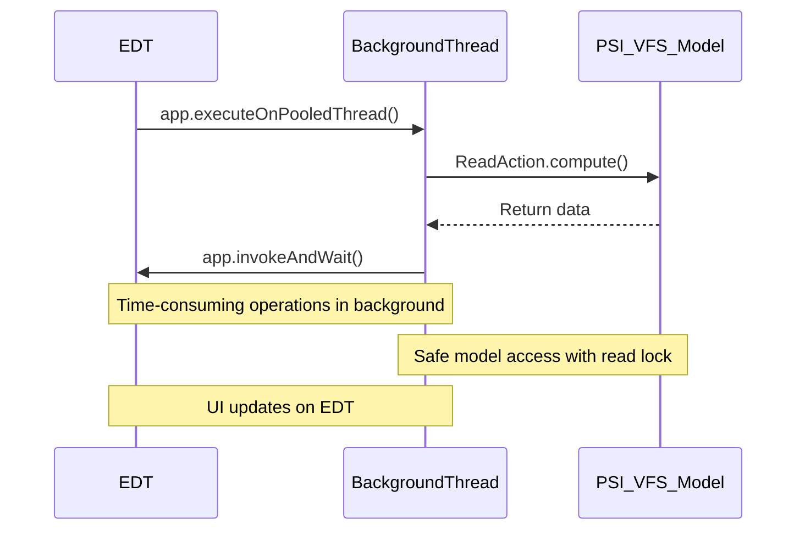
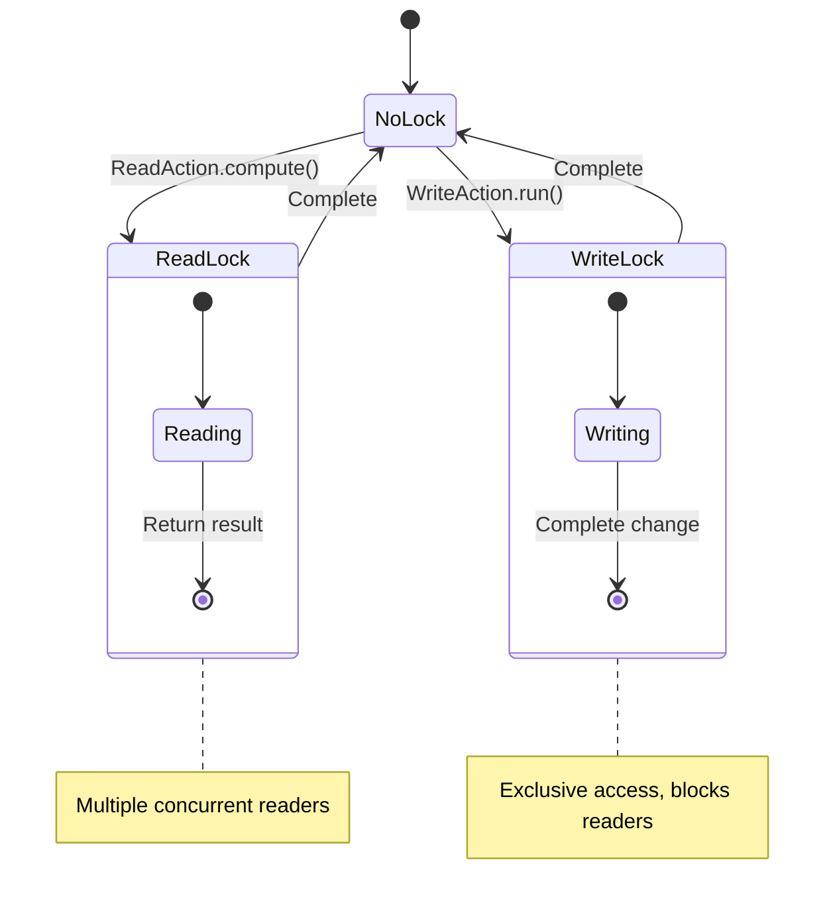
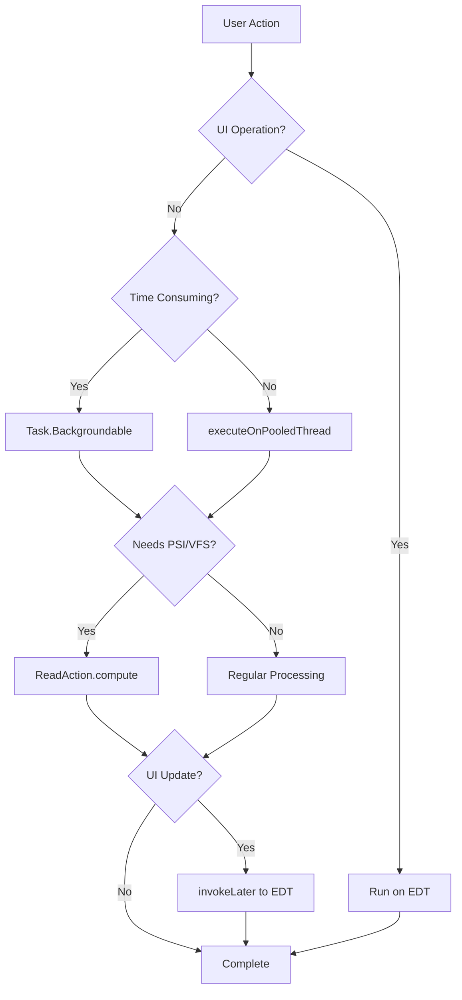

## Plugin official development template

## UI Designer Usage
### layout
- default layout
- other useful layout
### splitter

## IntelliJ Platform Threading Model

### Thread Types

| Thread Type | Purpose | Considerations |
|-------------|---------|----------------|
| **EDT** | UI rendering, event handling | No slow operations allowed |
| **Background thread pool** | Time-consuming tasks, IO, computation | Use ReadAction when accessing PSI/VFS |
| **Write thread** | Modifying PSI structures, project model | Requires write lock, generally managed by the platform |

### Task Execution Methods

| API | Thread Environment | Best Use Case | Example Code |
|-----|-------------------|--------------|--------------|
| `invokeAndWait` | EDT | Immediate UI updates | `app.invokeAndWait(() -> showDialog())` |
| `invokeLater` | EDT | Non-blocking UI updates | `app.invokeLater(dialog::show)` |
| `executeOnPooledThread` | Background | Simple background tasks | `app.executeOnPooledThread(() -> findFiles())` |
| `Task.Backgroundable` | Background + progress | Complex time-consuming tasks | `ProgressManager.run(new Task.Backgroundable(){})` |
| `ReadAction.compute()` | Current thread | Reading data model | `ReadAction.compute(() -> index.findFiles())` |
| `WriteAction.run()` | EDT + write lock | Modifying data model | `WriteAction.run(() -> psiFile.delete())` |

### Thread Switching Patterns



### Cancellation Support

```java
// Cancellable background task
ProgressManager.getInstance().run(new Task.Backgroundable(project, "Processing Files") {
    @Override
    public void run(@NotNull ProgressIndicator indicator) {
        // Set progress
        indicator.setFraction(0.1);
        indicator.setText("Analyzing...");
        
        // Check for cancellation
        if (indicator.isCanceled()) return;
        
        // Process in chunks to allow cancellation
        for (Item item : items) {
            indicator.checkCanceled(); // Cancellation check that throws exception
            process(item);
        }
    }
});
```

### Read/Write Lock Patterns

| Operation | When to Use | Code Example |
|-----------|-------------|--------------|
| Read operation | Accessing PSI, VFS, project model | `ReadAction.compute(() -> projectIndex.getFiles())` |
| Write operation | Modifying PSI, VFS, project structure | `WriteAction.run(() -> document.setText(newText))` |
| Read-modify-write | Atomic modifications | `WriteAction.run(() -> { Entity e = ReadAction.compute(() -> find()); e.modify(); })` |



### Common Issues and Solutions

| Issue | Solution |
|-------|----------|
| Slow operations on EDT | Move to background thread, Task.Backgroundable |
| Accessing PSI from background thread | Wrap with ReadAction.compute |
| Processing large files | Chunk tasks, support cancellation |
| UI freezes/unresponsiveness | Check for EDT-blocking operations |

### Complete Background Processing Example

```java
// Start background task to process files
public void processFiles(List<VirtualFile> files) {
    ProgressManager.getInstance().run(new Task.Backgroundable(project, "Processing Files") {
        @Override
        public void run(@NotNull ProgressIndicator indicator) {
            indicator.setIndeterminate(false);
            
            // Background thread processing
            List<Result> results = ReadAction.compute(() -> {
                List<Result> list = new ArrayList<>();
                int count = files.size();
                
                for (int i = 0; i < count; i++) {
                    indicator.checkCanceled(); // Support cancellation
                    indicator.setFraction((double)i / count);
                    
                    VirtualFile file = files.get(i);
                    indicator.setText2("Processing: " + file.getName());
                    
                    if (file.isValid()) {
                        list.add(processFile(file));
                    }
                }
                return list;
            });
            
            // Switch back to EDT for UI updates when done
            ApplicationManager.getApplication().invokeLater(() -> {
                updateUI(results);
            });
        }
    });
}
```

### Tasks Flow Visualization




