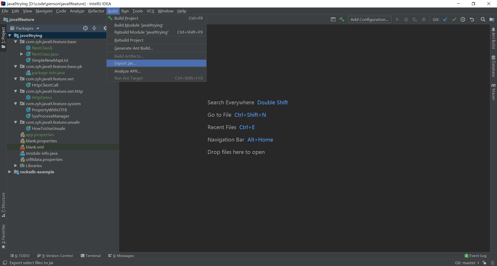
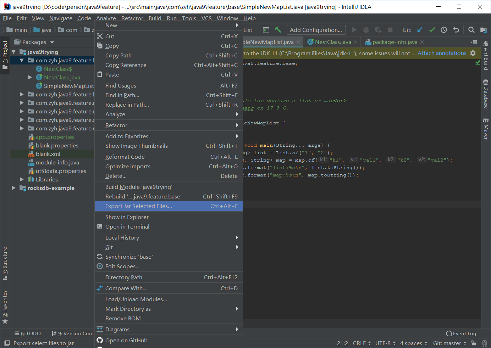
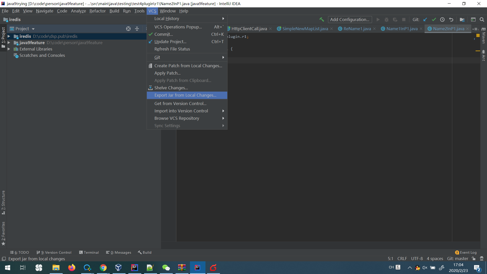
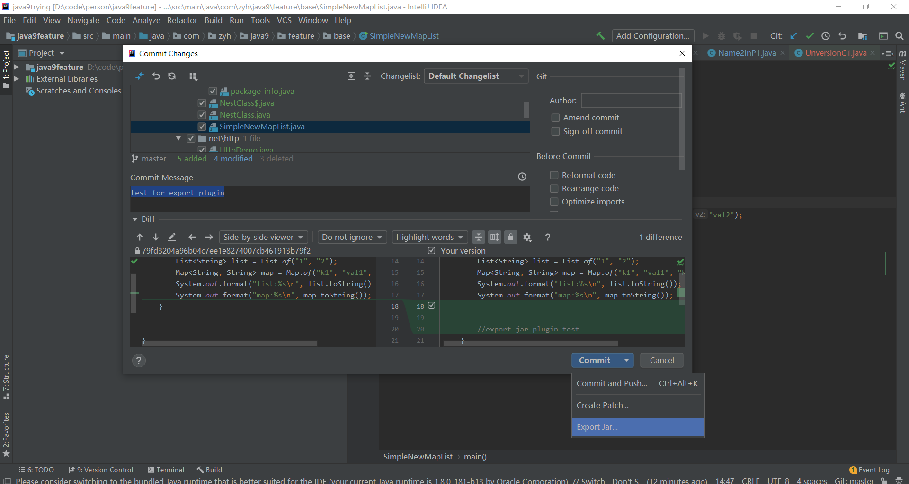
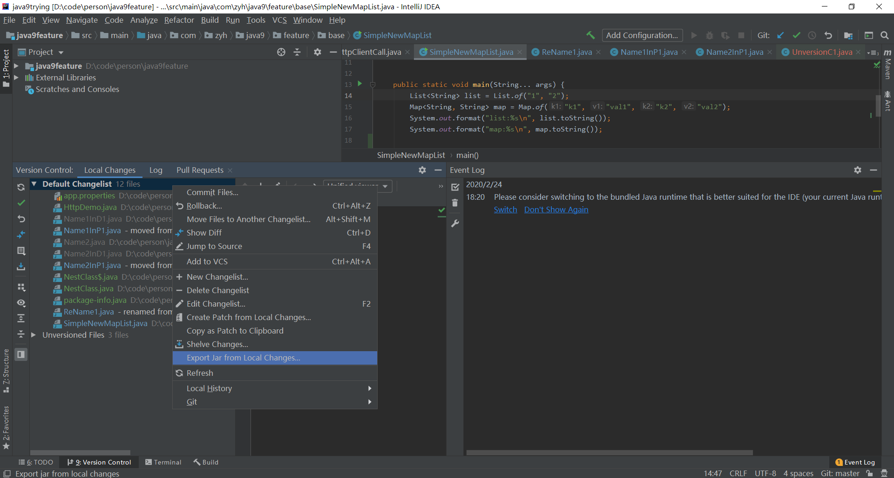
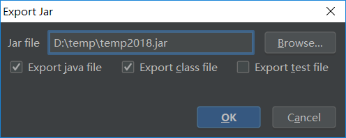
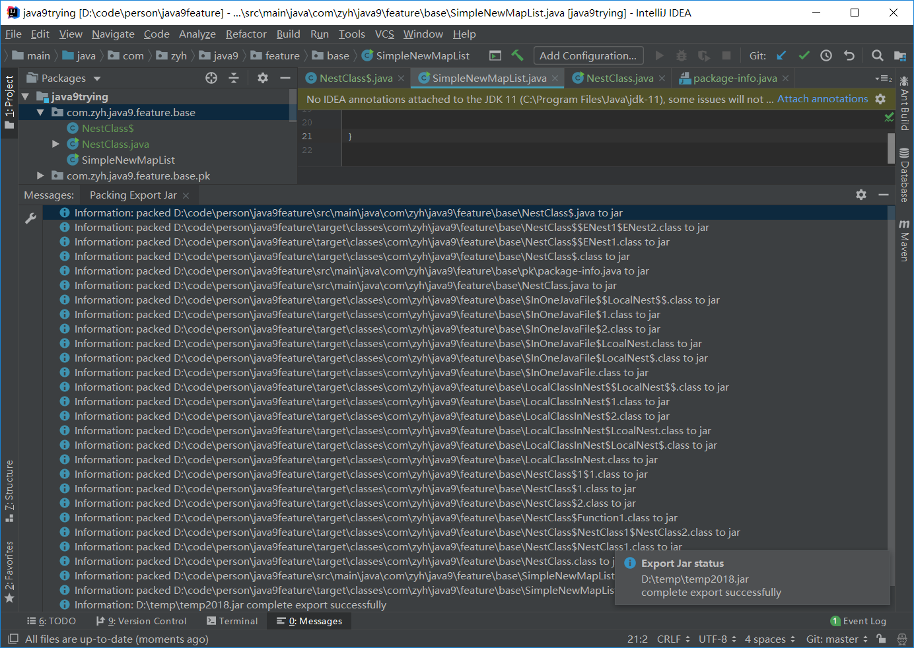

<!-- Plugin description -->
Plugin of Intellij IDEA for quickly export java project's class, resource, source file to jar, like Eclipse's action of export to jar. 

## features
- Quick and Handy export
- Supports export java, class, resource file in java project classpath and their compiled output directories
- Supports single file or multi-files selection for export
- Supports different scopes export: class, package, module, project
- Supports cross modules export (no duplication selected)
- Supports export files in test directory
- Supports custom setting export file type
- Supports export from vcs commits (local changes) as well as intrinsic "Create Patch" action 

## usage
- select files
  - right click mouse or click Build menu
  - select "Export Jar..." to perform export
- or click VCS menu  "Export Jar from Local Changes..."
- or in normal commit changes dialog, click "Export Jar..." in commit button group
<!-- Plugin description end -->

## runtime require
- v1: Intellij Idea (U & C) 2017.3 and later
- v2: Intellij Idea (U & C) 2020.2 and later

## plugin developing require
- [plugin development official guide](https://plugins.jetbrains.com/docs/intellij/intellij-artifacts.html)
- [plugin ide env template project](https://github.com/JetBrains/intellij-platform-plugin-template)
- when developing with 192+, please add following jars to SDK classpath:  
**installed root path/plugin/java/lib/\*.jar**  
**installed root path/lib/platform-core-ui.jar**  

## screenshot








## TODO 
- [OK]support inner and anonymous class export
- [OK]support large batch classes  export
- [OK]support multi module export, exit when encounter duplicate files
- [OK]fix the issue: export all when select resource folder
- [OK]support messages log levels
- [OK]prompt when exporting jar exists
- [OK]show successfully complete hint
- [OK]show successfully complete hint and link to export jar(no utility)
- [OK]select path textfield to list all selected history
- [OK]using sdk api to lookup nest class compiled files
- [OK]exclude test files (supports already)
- [OK]when export whole module, export files out scope in sources?
- [OK]add export action to Build menu
- [OK]write document
- [OK]register in Build Menu
- [OK]register key-map and shortcut (shortcut is OK)
- [OK]action can be perform from vcs menu as well as create patch
- action can be perform from history commit as well as create patch
- action can be perform from local history dialog
- show total export file(class,java, and others) count  
- try to use com.intellij.openapi.vfs.VfsUtilCore.visitChildrenRecursively  
- [OK]Git menu miss export jar... item in 2020.3 community
- [OK]show selected file in export dialog
- [OK]use com.intellij.ide.actions.RevealFileAction to show file in system fold
- multi-language
- help docs
- throw swing context event exception when trigger by first-keystroke (key-map)
- button component mnemonic not working
- remember dialog size
## Build
- config java homes for gradle to lookup JDK 11 and JDK 17
  - JAVA_HOME=path_to_jdk11
  - JAVA11_HOME=path_to_jdk11
  - JAVA17_HOME=path_to_jdk17

```shell
# win
.\gradlew.bat clean buildPlugin

# linux/macos
.\gradlew clean buildPlugin
```