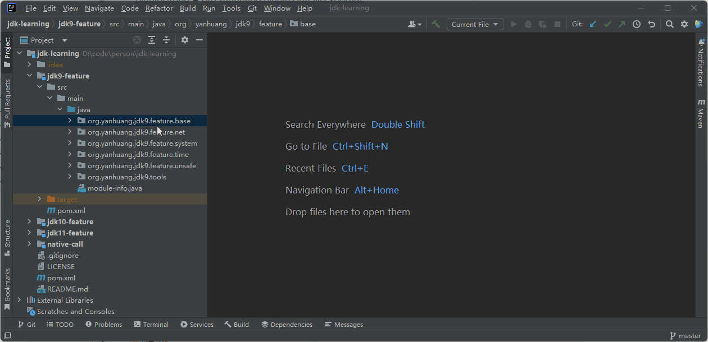
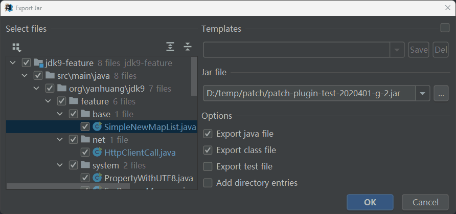
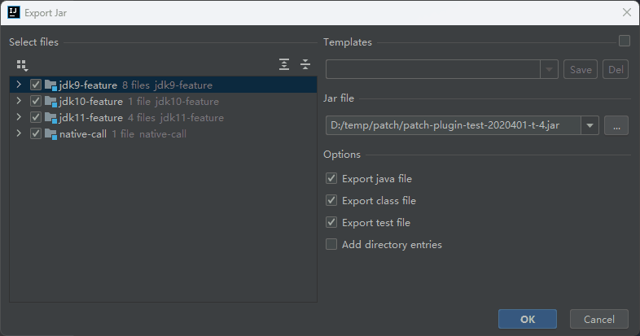
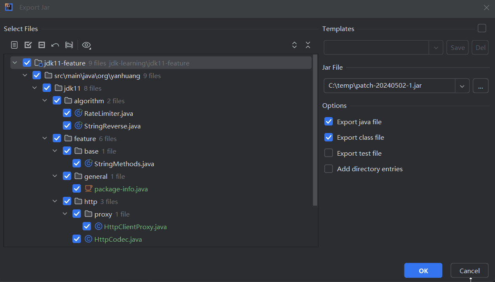
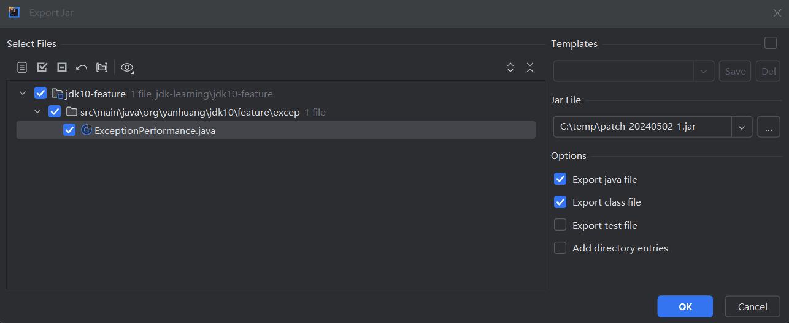
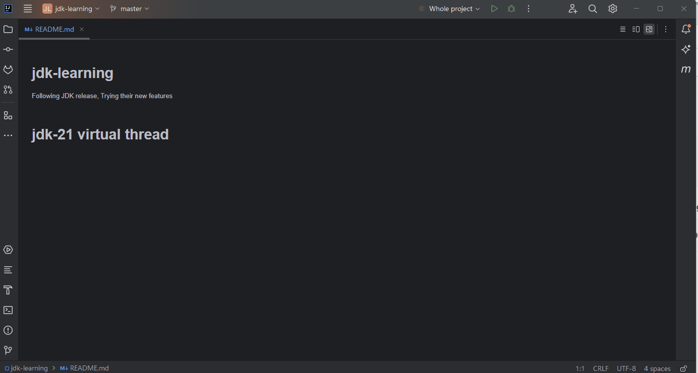
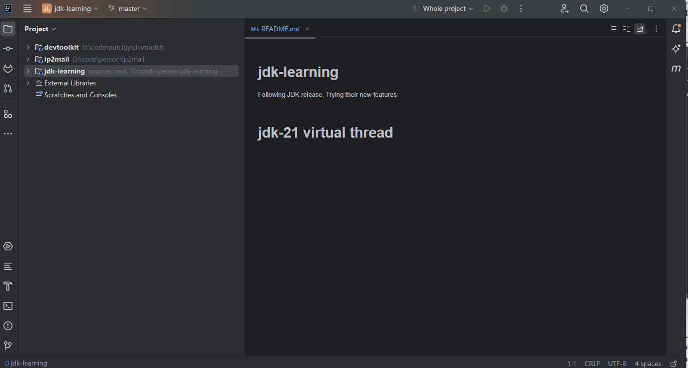

<!-- Plugin description -->
Plugin of Intellij IDEA for quickly export java project's class, resource, source file to jar, like Eclipse's action of export to jar. 

## features
- Quick and Handy export
- Supports export java, class, resource file in java project classpath and their compiled output directories
- Supports single file or multi-files selection for export
- Supports different scopes export: class, package, module, project
- Supports cross modules export (no duplication selected)
- Supports export files in test directory
- Supports custom setting export file type
- Supports export from vcs commits (local changes) as well as intrinsic "Create Patch" action 
- Supports save exporting files and options to templates then export by them
- Supports (recursively) include/exclude selection by directory as to can export the new files in select directories.

## usage
- select files
  - right click mouse or click Build menu
  - select "Export Jar..." to perform export
  - or select "Export Jar By Template" to perform export by template saved before
- or click Build menu  "Export Jar from Local Changes..."
- or in normal commit changes dialog, click "Export Jar..." in commit button group
<!-- Plugin description end -->

## runtime require
- v1.x.x: Intellij Idea (U & C) 2017.3 and later
- v2.x.x: Intellij Idea (U & C) 2020.2 and later

## plugin developing guide
- [plugin development official guide](https://plugins.jetbrains.com/docs/intellij/intellij-artifacts.html)
- [plugin dev project template (official)](https://github.com/JetBrains/intellij-platform-plugin-template)
  - notices
    - suggest using **2023+ IDEA IC or IU** as plugin develop environment 
    - upgrade dev tools copy following files from official template code:
    ```shell
       /gradle/*
       /gradle/wrapper/*
      ./build.gradle.kts
    ```
    - strongly suggest new plugin dev project generate by click [official github template](https://github.com/new?template_name=intellij-platform-plugin-template&template_owner=JetBrains) 
    - change build.gradle.kts to make building success, generally remove jvmToolchain line: vendor = JvmVendorSpec.JETBRAINS
    ```kotlin
      // Set the JVM language level used to tools to build the project. Use Java 11 for 2020.3+, and Java 17 for 2022.2+.
      kotlin {
      @Suppress("UnstableApiUsage")
          jvmToolchain {
              languageVersion = JavaLanguageVersion.of(17)
          }
      }
      // Set the JVM compatibility versions to generate plugin classes, javaVersion setting in gradle.properties
      properties("javaVersion").let {
          withType<JavaCompile> {
              sourceCompatibility = it.get()
              targetCompatibility = it.get()
          }
          withType<KotlinCompile> {
              kotlinOptions.jvmTarget = it.get()
          }
      }
    ```
    - **keep dependencies and tasks test section code in build.gradle.ks not remove**
    - change gradle.properties to make compatible
    - 
- plugin dev thread model notices
[read more](DevGuide.md)

## screenshot











## TODO 
- [OK]support inner and anonymous class export
- [OK]support large batch classes  export
- [OK]support multi module export, exit when encounter duplicate files
- [OK]fix the issue: export all when select resource folder
- [OK]support messages log levels
- [OK]prompt when exporting jar exists
- [OK]show successfully complete hint
- [OK]show successfully complete hint and link to export jar(no utility)
- [OK]select path textfield to list all selected history
- [OK]using sdk api to lookup nest class compiled files
- [OK]exclude test files (supports already)
- [OK]when export whole module, export files out scope in sources?
- [OK]add export action to Build menu
- [OK]write document
- [OK]register in Build Menu
- [OK]register key-map and shortcut (shortcut is OK)
- [OK]action can be perform from vcs menu as well as create patch
- action can be perform from history commit as well as create patch
- action can be perform from local history dialog
- show total export file(class,java, and others) count  
- try to use com.intellij.openapi.vfs.VfsUtilCore.visitChildrenRecursively  
- [OK]Git menu miss export jar... item in 2020.3 community
- [OK]show selected file in export dialog
- [OK]use com.intellij.ide.actions.RevealFileAction to show file in system fold
- multi-language
- help docs
- throw swing context event exception when trigger by first-keystroke (key-map)
- button component mnemonic not working
- [OK]remember dialog size
- reset dialog ui size
- plugin.xml item not working: add-to-group group-id="VcsGlobalGroup" anchor="after" relative-to-action="ChangesView.Shelve"
- [OK]make unused org.yanhuang.plugins.intellij.exportjar.ui.FileListDialog.FileListTree to use for some tree select operation.
## Build
- config java homes for gradle to lookup JDK 11 and JDK 17
  - JAVA_HOME=path_to_jdk17 (**use IntelliJ Platform Gradle Plugin 2.x must use jdk17 to run gradle**)
  - JAVA11_HOME=path_to_jdk11
  - JAVA17_HOME=path_to_jdk17

```shell
# win
.\gradlew.bat clean buildPlugin -i -V
or
.\gradlew.bat clean buildPlugin verifyPlugin -i -V


# linux/macos
./gradlew clean buildPlugin -i -V
or
./gradlew clean buildPlugin verifyPlugin -i -V
```
!!When buildPlugin throw **build/tmp/initializeIntelliJPlugin/coroutines-javaagent.jar not found** error change gradle.properties
```kotlin
org.gradle.configuration-cache = false
```
!!Update: above issue disappeared from IntelliJ Platform Gradle Plugin 2.0

**[See the issue in Github](https://github.com/JetBrains/gradle-intellij-plugin/issues/1491)**
- **!!Gradle plugin 1.12.0, at this plugin one version build multi-times will lead plugin not available!! You must modify plugin version number before every build or run or debug**
- **!!If download gradle.bin timeout, please change IDEA system networks proxy**

## Development